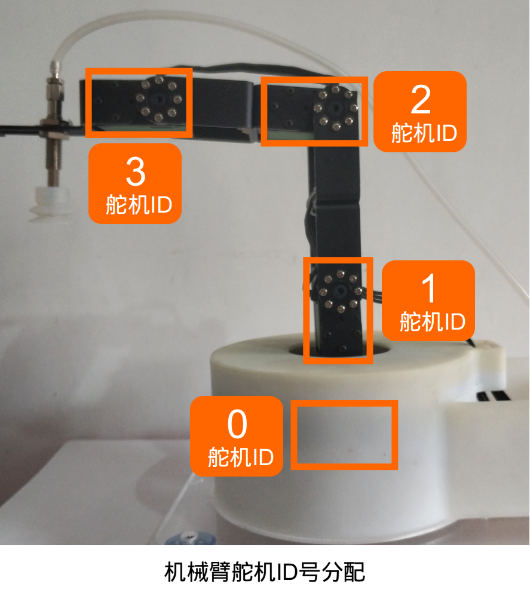

# 机械臂开发准备工作

[toc]


**文档版本管理**

| 文档名称     | 机械臂开发准备工作 |
| ------------ | ------------------ |
| 作者         | 阿凯               |
| 邮箱         | kyle.xing@fashionstar.com.hk |
| 文档更新时间 | 2020-02-18         |
| 版本说明     | 初次完成文档       |

## 1. 分配舵机ID

如果你对串口舵机使用不是很熟悉, 请参阅 [Fashion Star的串口总线舵机使用手册](https://wiki.fashionrobo.com/uartbasic/)


使用机械臂之前,需要分配舵机的ID号. 舵机ID如下图所示:




## 2. 物理接线

> TODO 此处可以配图/安装视频


* 机械臂各个舵机串联在一起, 并与拓展板上的UART舵机接口相连.
* 将电磁阀的线接入到拓展板的`SW` 接口处
* 将微型气泵电机的线接入到拓展板的`MT` 接口处.
* 接通外接电源, 打开拓展板的电源开关


## 3. 世界坐标系

机械臂的世界坐标系/机械臂基坐标系定义如下:


世界坐标系的原点定义在#1号舵机的转轴中心处, 机械臂正前方为X轴, 上方为Z轴, Y轴指向纸面朝外.


## 4. 机械臂的关节标定

关节与关节坐标系定义如下图所示:


标定机械臂关节, 求得关节空间到舵机原始角度的映射关系.

详情见文档[机械臂关节标定](../2.机械臂关节标定/机械臂关节标定.md)

标定完成之后同步修改`src/config.py`

```python
# 舵机原始角度与关节弧度转换对应的偏移量与比例系数
JOINT2SERVO_K=[-56.818, 56.659, -59.842, -58.251]
JOINT2SERVO_B=[-9.250,93.000,48.000,-1.500]
```


## 5. 机械臂的连杆标定

连杆定义如下图所示:


使用游标卡尺/其他测量工具,测量实际的连杆长度, 并同步到`src/config.py`里面, 单位为cm.

```python
##########################################
## 机械臂-连杆参数
## 单位cm
##########################################
LINK23 = 8.0    # JOINT2与JOINT3(腕关节)的长度
LINK34 = 7.6    # JOINT3与JOINT4(腕关节)的长度       
LINK45 = 5.5    # JOINT4与JOINT5(腕关节)的长度 
TOOL_LEN = 4.6  # 工具的长度(气泵连杆的长度)
```

