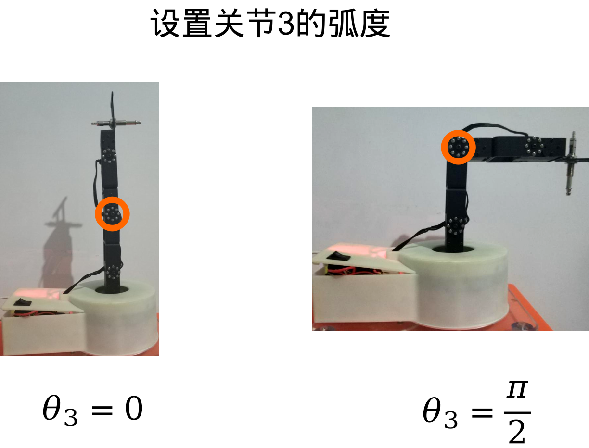
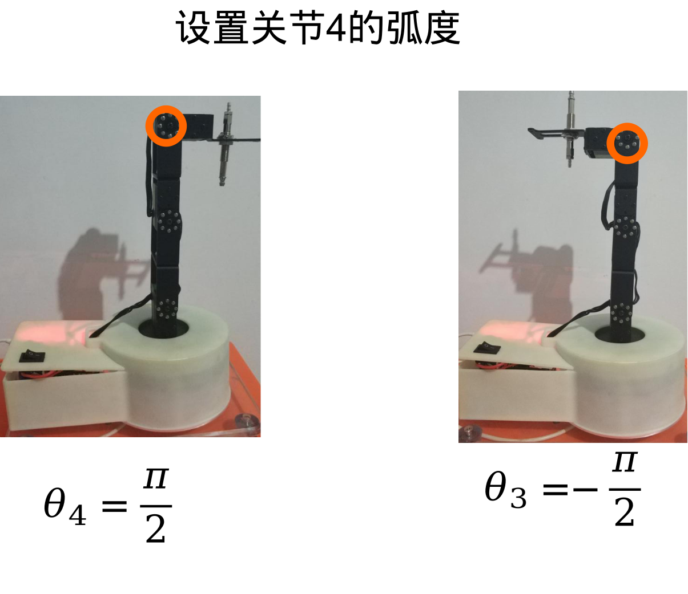

# 机械臂(4DoF)关节标定

[toc]

**文档版本管理**

| 文档名称     | 机械臂(4DoF)关节标定 |
| ------------ | -------------------- |
| 作者         | 阿凯                 |
| 邮箱         | kyle.xing@fashionstar.com.hk   |
| 文档更新时间 | 2020-02-18           |
| 版本说明     | 初次完成文档         |

## 1. 概要

标定机械臂关节, 求得关节空间到舵机原始角度的映射关系.

源代码见`src/机械臂关节标定.ipynb`

## 2. 采集数据

### 2.1. 导入依赖


```python
import math
from fs_arm_4dof import Arm4DoF
from config import *
```

### 2.2. 机械臂初始化


```python
arm = Arm4DoF()
```

### 2.3. 调整关节1的弧度


调整0号舵机, 让关节1旋转到弧度 $\theta_1 = \frac{\pi}{2}$


```python
j1_p90_srv_angle =  -98.5 # 当关节1等于90度的时候的舵机原始角度
arm.set_servo_angle({JOINT1:j1_p90_srv_angle}, wait=True) 
```


调整0号舵机, 让关节1旋转到弧度 $\theta_1 = -\frac{\pi}{2}$


```python
j1_n90_srv_angle =  80 # 当关节1等于-90度的时候的舵机原始角度
arm.set_servo_angle({JOINT1:j1_n90_srv_angle}, wait=True)
```


调整0号舵机, 让关节1旋转到弧度$\theta_1 = 0$


```python
arm.set_servo_angle({JOINT1:-10}, wait=True)
```

### 2.4. 调整关节2


调整1号舵机, 让关节2旋转到弧度 $\theta_2=0$


```python
j2_p0_srv_angle = 93 # 当关节2等于0度的时候的舵机原始角度
arm.set_servo_angle({JOINT2:j2_p0_srv_angle}, wait=True)
```


调整1号舵机, 让关节2旋转到弧度 $\theta_2=-\pi$


```python
j2_n180_srv_angle = -85 # 当关节2等于-180度的时候的舵机原始角度
arm.set_servo_angle({JOINT2:j2_n180_srv_angle}, wait=True)
```


调整1号舵机, 让关节2旋转到弧度$\theta_2=-\frac{\pi}{2}$


```python
arm.set_servo_angle({JOINT2:5}, wait=True)
```

### 2.5. 调整关节3



调整2号舵机, 让关节3旋转到弧度 $\theta_3=\frac{\pi}{2}$


```python
j3_p90_srv_angle=-46 #当关节3等于90度的时候的舵机原始角度
arm.set_servo_angle({JOINT3:j3_p90_srv_angle}, wait=True)
```

    INFO:root:设置舵机角度, 舵机#2 目标角度 -46.0
    INFO:root:串口发送请求数据 code:8
    INFO:root:数据帧内容:
    INFO:root:0x12 0x4c 0x08 0x07 0x02 0x34 0xfe 0x20 0x03 0x00 0x00 0xc4 


调整2号舵机, 让关节3旋转到弧度 $\theta_3=0$


```python
j3_p0_srv_angle=48 #当关节3等于90度的时候的舵机原始角度
arm.set_servo_angle({JOINT3:j3_p0_srv_angle}, wait=True)
```

    INFO:root:设置舵机角度, 舵机#2 目标角度 48.0
    INFO:root:串口发送请求数据 code:8
    INFO:root:数据帧内容:
    INFO:root:0x12 0x4c 0x08 0x07 0x02 0xe0 0x01 0x20 0x03 0x00 0x00 0x73 

### 2.6. 调整关节4



调整3号舵机, 让关节4旋转到弧度 $\theta_4=\frac{\pi}{2}$


```python
j4_p90_srv_angle=-93 #当关节4等于90度的时候的舵机原始角度
arm.set_servo_angle({JOINT4:j4_p90_srv_angle}, wait=True)
```

    INFO:root:设置舵机角度, 舵机#3 目标角度 -93.0
    INFO:root:串口发送请求数据 code:8
    INFO:root:数据帧内容:
    INFO:root:0x12 0x4c 0x08 0x07 0x03 0x5e 0xfc 0x26 0x07 0x00 0x00 0xf7 


调整3号舵机, 让关节4旋转到弧度 $\theta_4=-\frac{\pi}{2}$


```python
j4_n90_srv_angle=90 #当关节4等于-90度的时候的舵机原始角度
arm.set_servo_angle({JOINT4:j4_n90_srv_angle}, wait=True)
```

    INFO:root:设置舵机角度, 舵机#3 目标角度 90.0
    INFO:root:串口发送请求数据 code:8
    INFO:root:数据帧内容:
    INFO:root:0x12 0x4c 0x08 0x07 0x03 0x84 0x03 0x20 0x03 0x00 0x00 0x1a 


## 3. 标定舵机

计算各个关节的比例系数与角度偏移量. 用一个简单的一次函数来表示舵机原始角度与机械臂关节弧度之间的关系

$$
angle_i = k_i*\theta_{i} + b_i
$$

* $\theta_i$关节弧度
* $angle_i$ 舵机原始角度
* $k_i$ 比例系数
* $b_i$ 偏移量


```python
def calc_kb(angle_a, angle_b, theta_a, theta_b):
    k = (angle_a-angle_b) / (theta_a-theta_b)
    b = angle_a - k*theta_a
    return k, b
```


```python
k1, b1 = calc_kb(j1_n90_srv_angle, j1_p90_srv_angle, -math.pi/2, math.pi/2)
k2, b2 = calc_kb(j2_n180_srv_angle, j2_p0_srv_angle, -math.pi, 0)
k3, b3 = calc_kb(j3_p0_srv_angle, j3_p90_srv_angle, 0, math.pi/2)
k4, b4 = calc_kb(j4_n90_srv_angle, j4_p90_srv_angle, -math.pi/2, math.pi/2)
```


```python
print('JOINT2SERVO_K=[{:.3f}, {:.3f}, {:.3f}, {:.3f}]\nJOINT2SERVO_B=[{:.3f},{:.3f},{:.3f},{:.3f}]'.format(k1, k2, k3, k4, b1, b2, b3, b4))
```

    JOINT2SERVO_K=[-56.818, 56.659, -59.842, -58.251]
    JOINT2SERVO_B=[-9.250,93.000,48.000,-1.500]


将打印出来的字符串替换掉`config.py`里面的`JOINT2SERVO_K`与`JOINT2SERVO_B`

`config.py`
```python
# 舵机原始角度与关节弧度转换对应的偏移量与比例系数
JOINT2SERVO_K=[-56.818, 56.659, -59.842, -58.251]
JOINT2SERVO_B=[-9.250,93.000,48.000,-1.500]
```
