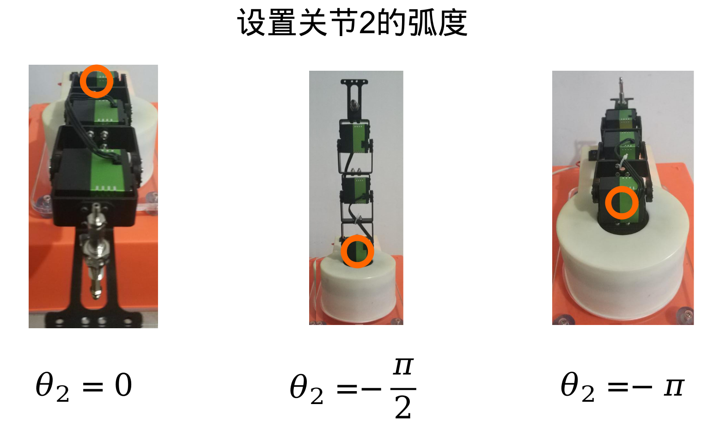
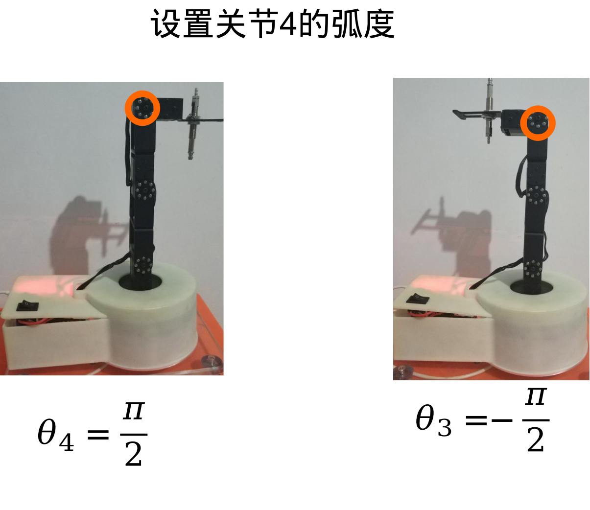

# 机械臂演示例程(Python)


[toc]

**文档版本管理**

| 文档名称     | 机械臂演示例程(Python) |
| ------------ | ---------------------- |
| 作者         | 阿凯                   |
| 邮箱         | kyle.xing@fashionstar.com.hk     |
| 文档更新时间 | 2020-02-18             |
| 版本说明     | 初次完成文档           |


## 1. 如何使用机械臂的库文件

### 1.1. 工程文件结构

工程文件的最上层的目录如下所示


* `doc`存放的是项目相关的使用文档

* `src` 源码文件, 实现了机械臂的SDK

  

* `example` 是机械臂SDK的演示例程

  


### 1.2. 追加系统路径

`example` 文件夹里面每一个`py`文件开头都有这么几行代码.

```python
# 添加系统路径
import sys
sys.path.append('../src/')
# 导入依赖
import time
from fs_arm_4dof import Arm4DoF
from config import *
```


因为同目录下并没有`fs_arm_4dof.py`与`config.py`这两个python脚本. 他们定义在了`src`文件夹下.

所以开头才需要在系统路径里面追加从当前的`python`脚本文件到`src`文件夹的**相对路径**.

```python
sys.path.append('../src/')
```


## 2. 设置舵机原始角度


### 2.1. 机械臂实例化

在`/src/fs_arm_4dof.py`里面定义了4自由度机械臂的功能实现.

创建一个四自由度机械臂的实例, 命名为`arm`

```python
from fs_arm_4dof import Arm4DoF
# 机械臂初始化
arm = Arm4DoF()
```

arm在实例化的过程中, 会将机械臂驱动至初始姿态.

### 2.2. 关节与舵机ID的映射关系

在`src/config.py` 里面定义了机械臂相关的常量

```python
from config import *
```

`config.py`里面定义了每个关节对应的舵机ID号

`config.py`代码片段

```python
##########################################
## 机械臂-关节设置
##
##########################################
# 关节的编号, 也是关节对应的串口总线舵机的ID号
# 注: JNT是Joint的缩写
JOINT1 = 0
JOINT2 = 1
JOINT3 = 2
JOINT4 = 3
```


### 2.3. 设置舵机角度

使用`set_servo_angle`函数设置机械臂舵机的原始角度, 可以传入字典/数组. 如果传入的是字典数据类型, `key`为舵机的ID号, 取值范围 $[0, 3]$ ; `value` 为角度值.

```python
# 设置机械臂舵机的原始角度
# * 关节1对应的#0舵机 --> -45°
# * 关节2对应的#1舵机 -->  20°
# * 关节3对应的#2舵机 --> -45°
# * 关节4对应的#3舵机 -->   0°
arm.set_servo_angle({JOINT1: -45, JOINT2: 20, JOINT3:-45, JOINT4:0}, wait=True)
```

`wait` 参数, 定义在执行这条语句的时候,  是否阻塞. 如果`wait=True`, 那么只有舵机旋转到预设的角度, 该语句才会完成执行.


### 2.4. 演示例程

**功能说明**

设置机械臂舵机的原始角度

**效果视频**

[设置舵机原始角度](../../video/2.设置舵机原始角度.mp5)

**源代码**

`/example/set_servo_raw_angle.py`

```python
'''
设置机械臂舵机的原始角度
* 作者: 阿凯
* Email: kyle.xing@fashionstar.com.hk
* 更新时间: 2020-02-18
'''
# 添加路径
import sys
sys.path.append('../src/')
# 导入依赖
import time
from fs_arm_4dof import Arm4DoF
from config import *

# 机械臂初始化
arm = Arm4DoF()
# 设置机械臂舵机的原始角度
# * 关节1对应的#0舵机 --> -45°
# * 关节2对应的#1舵机 -->  20°
# * 关节3对应的#2舵机 --> -45°
# * 关节4对应的#3舵机 -->   0°
arm.set_servo_angle({JOINT1: -45, JOINT2: 20, JOINT3:-45, JOINT4:0}, wait=True)
# 等待1s
time.sleep(1)
# 单独设置关节1的舵机角度为0°
arm.set_servo_angle({JOINT1: 0}, wait=True)

```


## 3. 设置舵机的转速

### 3.1. 舵机调速

通过`set_servo_velocity`函数, 设置舵机旋转的平均转速, 单位为dps(度/秒)

```python
# 设置舵机的平均转速为20 dps
arm.set_servo_velocity(20)
```


### 3.2. 演示例程

**功能说明**

调整舵机的平均转速,延时不同转速下的效果

**效果视频**

[3.设置舵机的转速](../../video/3.设置舵机的转速.mp4)

**完整源码**

`/example/set_servo_velocity.py`

```python
'''
调整舵机的平均转速,延时不同转速下的效果
* 作者: 阿凯
* Email: kyle.xing@fashionstar.com.hk
* 更新时间: 2020-02-18
'''
# 添加路径
import sys
sys.path.append('../src/')
# 导入依赖
import time
from fs_arm_4dof import Arm4DoF
from config import *

# 机械臂初始化
arm = Arm4DoF()
# 设置#0舵机角度为0°
arm.set_servo_angle({JOINT1: 0}, wait=True)

# 设置舵机的平均转速为20, 单位是dps(度/秒)
arm.set_servo_velocity(20)
# 设置#0舵机角度为－45°
arm.set_servo_angle({JOINT1: -45}, wait=True)
# 等待1s
time.sleep(1)

# 设置舵机的平均转速为150, 单位是dps(度/秒)
arm.set_servo_velocity(150)
# 设置#0舵机角度为0°
arm.set_servo_angle({JOINT1: 0}, wait=True)

```


## 4. 设置关节的弧度

### 4.1. 设置关节弧度

通过`set_joint`函数设置机械臂关节的弧度, 注意是弧度而不是角度.

```python
import math
from math import pi
# 设置关节的弧度
# - 关节1 -->   0
# - 关节2 --> -pi/2
# - 关节3 -->  pi/2
# - 关节4 --> -pi/2
arm.set_joint({JOINT1: 0, JOINT2: -pi/2, JOINT3:pi/2, JOINT4:-pi/2}, wait=True)
```


在`config.py`里面定义了每个关节的弧度上限跟下限

```python
# 关节弧度的范围
THETA_LOWERB = [-math.pi/2, -math.pi, 0, -math.pi/2]
THETA_UPPERB = [math.pi/2, 0, 3*math.pi/4, math.pi/2]
```

| 关节   | 弧度下限         | 弧度上限         |
| ------ | ---------------- | ---------------- |
| JOINT1 | $-\frac{\pi}{2}$ | $\frac{\pi}{2}$  |
| JOINT2 | $-\pi$           | 0                |
| JOINT3 | 0                | $\frac{3\pi}{4}$ |
| JOINT4 | $-\frac{\pi}{2}$ | $\frac{\pi}{2}$  |








### 4.2. 演示例程

**功能说明**

设置机械臂关节的弧度

**效果视频**

[4.设置关节的弧度](../../video/4.设置关节的弧度.mp4)

**完整源码**

`/example/set_joint.py`

```python
'''
设置机械臂关节的弧度
* 作者: 阿凯
* Email: kyle.xing@fashionstar.com.hk
* 更新时间: 2020-02-18
'''
# 添加路径
import sys
sys.path.append('../src/')
# 导入依赖
import time
import math
from math import pi
from fs_arm_4dof import Arm4DoF
from config import *

# 机械臂初始化
arm = Arm4DoF()
# 设置关节的弧度
# - 关节1 -->   0
# - 关节2 --> -pi/2
# - 关节3 -->  pi/2
# - 关节4 --> -pi/2
arm.set_joint({JOINT1: 0, JOINT2: -pi/2, JOINT3:pi/2, JOINT4:-pi/2}, wait=True)
# 等待1s
time.sleep(1)
# 设置单个关节的弧度
# - 关节1 --> pi/3
arm.set_joint({JOINT1: math.pi/3})
```


## 5. 设定工具的坐标

### 5.1. 世界坐标系

世界坐标系的原点定义在#1号舵机的转轴中心处, 机械臂正前方为X轴, 上方为Z轴, Y轴指向纸面朝外.


### 5.2. move函数

`move`函数用于设定末端执行器(气泵吸头)在世界坐标系下的坐标.

```python
# 设置末端执行器(气泵吸头)的位置运动到 x=5cm y=0cm z=5cm
arm.move([5, 0, 5], wait=True)
```


### 5.3. 演示例程

**功能说明**

测试移动机械臂末端执行器的位置

**效果视频**

[5.设定工具的坐标](../../video/5.设定工具的坐标.mp4)

**完整源码**

`/example/move_tool.py`

```python
'''
测试移动机械臂末端执行器的位置
* 作者: 阿凯
* Email: kyle.xing@fashionstar.com.hk
* 更新时间: 2020-02-18
'''
# 添加路径
import sys
sys.path.append('../src/')
# 导入依赖
import time
from fs_arm_4dof import Arm4DoF
from config import *

# 机械臂初始化
arm = Arm4DoF()
# 设置末端执行器(气泵吸头)的位置运动到 x=5cm y=0cm z=5cm
arm.move([5, 0, 5], wait=True)
# 等待1s
time.sleep(1)
# 设置末端执行器(气泵吸头)的位置运动到 x=5cm y=5cm z=10cm
arm.move([5, 5, 10], wait=True)
```


## 6. 气泵控制

### 6.1. 气泵控制

气泵的控制是独立于机械臂本体控制的，定义在`/src/micro_pump.py`里面.

创建气泵对象

```python
pump = MicroPump()
```

气泵开, 吸气

```python
pump.on()
```

气泵关, 放气

```python
pump.off()
```


### 6.2. 演示例程

**功能说明**

气泵开启然后关闭

**效果视频**

[气泵控制](../../video/6.气泵控制.mp4)

**完整源码**

`/example/pump_control.py`

```python
'''
控制气泵吸气与放气

注: 气泵相关的逻辑取决于所运行的平台,若有变更需修改micro_bump.py
* 作者: 阿凯
* Email: kyle.xing@fashionstar.com.hk
* 更新时间: 2020-02-18
'''
# 添加路径
import sys
sys.path.append('../src/')
# 导入依赖
import time
from micro_pump import MicroPump

# 创建气泵对象
pump = MicroPump()
# 气泵开启,吸气
pump.on()
# 等待2s
time.sleep(2)
# 气泵关闭,放气
pump.off()
```


## 7. 机械臂物块搬运

### 7.1. 演示例程

**功能说明**

机械臂物块搬运，本质上就是将`5. 设定工具的坐标`跟`6. 气泵控制`融合在一起.

**效果视频**

[7.机械臂物块搬运](../../video/7.机械臂物块搬运.mp4)

 **完整源码**

```python
'''
使用气泵完成对木块的搬运
* 作者: 阿凯
* Email: kyle.xing@fashionstar.com.hk
* 更新时间: 2020-02-18
'''
# 添加路径
import sys
sys.path.append('../src/')
# 导入依赖
import time
from fs_arm_4dof import Arm4DoF
from micro_pump import MicroPump
from config import *

# 创建机械臂对象
arm = Arm4DoF()
# 创建气泵对象
pump = MicroPump()

# 吸头运动到木块的正上方
arm.move([12, 6, 4])
# 等待1s
time.sleep(1)
# 吸头落下
arm.move([12, 6, 0.5])
# 气泵开启
pump.on()
# 抬起物块
arm.move([12, 6, 4])
# 等待1s
time.sleep(1)
# 将木块抬至目的地的正上方
arm.move([12, -6, 4])
# 等待1s
time.sleep(1)
# 落下,让木块接近平面
arm.move([12, -6, 1])
# 释放气泵
pump.off()
# 吸头抬起
arm.move([12, -6, 4])
# 初始化机械臂的位姿
arm.init_pose()

```

