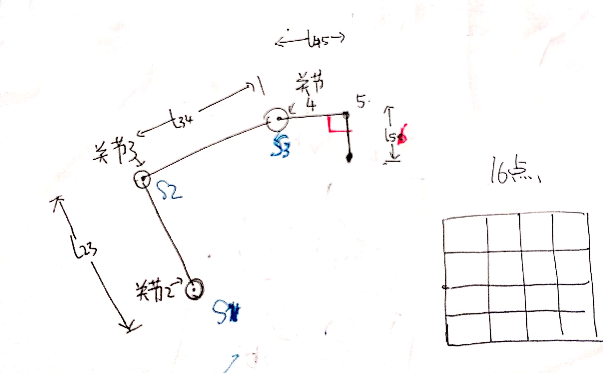

# 四自由度机械臂梯度下降公式推导

## 正向运动学

假设$\theta_1 = 0$, $y = 0$

为了表示方便
$$
\theta_{23} = \theta2 + \theta_3
$$

$$
\theta_{234} = \theta2 + \theta_3 + \theta_4
$$

$$
x = l_{23}*cos(\theta_2) + l_{34}*cos(\theta_{23}) + l_{45}*cos(\theta_{234})
- l_{56}*sin(\theta_{234})
$$

$$
z = -l_{23}sin(\theta_2) -l_{34}*sin(\theta_{23}) -l_{45}*sin(\theta_{234}) - l_{56}*cos(\theta_{234})
$$

## 求偏导数

$$
\frac{\partial{x}}{\partial{\theta_4}} = -l_{45}*sin(\theta_{234}) - l_{56}*cos(\theta_{234})
$$

$$
\begin{align*}
\frac{\partial{x}}{\partial{\theta_3}} &=  -l_{34}*sin(\theta_{23})  -l_{45}*sin(\theta_{234}) - l_{56}*cos(\theta_{234}) \\
&= -l_{34}*sin(\theta_{23}) + \frac{\partial{x}}{\partial{\theta_4}}
\end{align*}
$$

$$
\begin{align*}
\frac{\partial{x}}{\partial{\theta_2}} &=  -l_{23} * sin(\theta_2)-l_{34}*sin(\theta_{23})  -l_{45}*sin(\theta_{234}) - l_{56}*cos(\theta_{234}) \\
&=-l_{23} * sin(\theta_2) + \frac{\partial{x}}{\partial{\theta_3}}
\end{align*}
$$

$$
\frac{\partial{z}}{\partial{\theta_4}} = -l_{45}*cos(\theta_{234}) + l_{56}*sin(\theta_{234})
$$

$$
\frac{\partial{z}}{\partial{\theta_3}} = -l_{34} * cos(\theta_{23}) + \frac{\partial{z}}{\partial{\theta_4}}
$$

$$
\frac{\partial{z}}{\partial{\theta_2}} = -l_{23} * cos(\theta_{2}) + \frac{\partial{z}}{\partial{\theta_3}}
$$

## 关节空间与舵机角度空间的映射

> 注： 这里为了方便计算, 将舵机角度转换为弧度制.

$s_i$ 代表编号为$i$的舵机角度->弧度

| 关节  | 舵机ID |
| ----- | ------ |
| 关节2 | 1      |
| 关节3 | 2      |
| 关节4 | 3      |

$$
s_1 = k_2*\theta_2 + b_2
$$

$$
s_2 = k_3*\theta_3 + b_3
$$

$$
s_3 = k_4*\theta_4 + b_4
$$
整理得
$$
\theta_2 = \frac{s_1 - b_2}{k_2}
$$

$$
\theta_3 = \frac{s_2 - b_3}{k_3}
$$

$$
\theta_4 = \frac{s_3 - b_4}{k_4}
$$

$$
\frac{\partial \theta_2}{\partial k_2} = \frac{b_2-s_1}{k_2^2}
$$

$$
\frac{\partial \theta_3}{\partial k_3} = \frac{b_3-s_2}{k_3^2} 
$$

$$
\frac{\partial \theta_4}{\partial k_4} = \frac{b_4-s_3}{k_4^2} 
$$

$$
\frac{\partial \theta_2}{\partial b_2} = -\frac{1}{k_2} 
$$

$$
\frac{\partial \theta_3}{\partial b_3} = -\frac{1}{k_3} 
$$

$$
\frac{\partial \theta_4}{\partial b_4} = -\frac{1}{k_4}
$$

## 链式求导法则

$$
\frac{\partial{x}}{\partial{k_2}} = \frac{\partial{x}}{\partial{\theta_2}} * \frac{\partial \theta_2}{\partial k_2}
$$

$$
\frac{\partial{x}}{\partial{b_2}} = \frac{\partial{x}}{\partial{\theta_2}} * \frac{\partial \theta_2}{\partial b_2}
$$

$$
\frac{\partial{z}}{\partial{k_2}} = \frac{\partial{z}}{\partial{\theta_2}} * \frac{\partial \theta_2}{\partial k_2}
$$

$$
\frac{\partial{z}}{\partial{b_2}} = \frac{\partial{z}}{\partial{\theta_2}} * \frac{\partial \theta_2}{\partial b_2}
$$

k3, b3, k4,b4 类似，不一一列举 